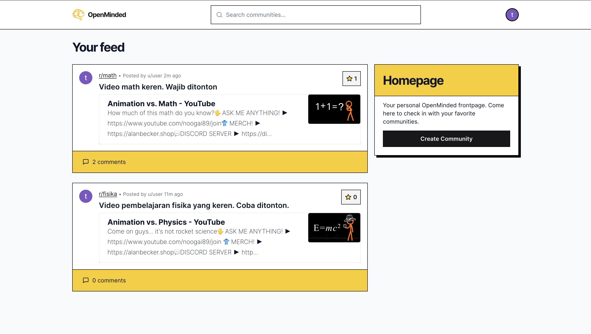
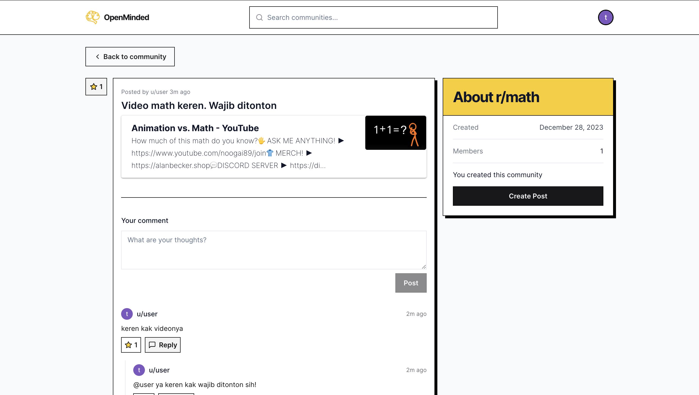

# Forum E-learning platform


## Screenshots






## Tech Stack

**Client:** Next.js Typescript, TailwindCSS, Shadcn-ui

**Server:** Node, Zod, MySQL, Uploadthing, Redis, Prisma 


## Features

- Create a community, Join as member
- Tree structure reply post
- Rich text editor
- Google authentication 


## Installation

Clone and cd into the repo.

```bash
  git clone -b master https://github.com/BabyJnL/elearning-winterwonderhack-fe.git
  cd elearning-winterwonderhack-fe
```

Install the dependencies
```bash
npm install --legacy-peer-deps
```

Create a `.env` file in the root dir. **COPY** and **FILL** each of this key with credentials value. `DATABASE_URL` _using planetscale mysql based cloud database platform._

```bash
DATABASE_URL=
NEXTAUTH_SECRET=

GOOGLE_CLIENT_ID=
GOOGLE_CLIENT_SECRET=

UPLOADTHING_SECRET=
UPLOADTHING_APP_ID=

REDIS_URL=
REDIS_SECRET=
```

Run prisma command

```bash
  npx prisma generate
  npx prisma db push
```

Start the development server

```bash
  npm run dev
```

